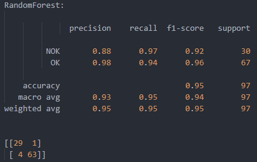

# Classification

SVM Sigmoid &amp;  SVM Radial Basis &amp; SVM Polynomial &amp; SVM Linear &amp; GNB &amp; LDA &amp; KNN &amp; CatBoost &amp; XGBoost &amp; Randomforest &amp; LGBM used in one script for classification.

Classification is a large domain in the field of statistics and machine learning. Generally, classification can be broken down into two areas:

    Binary classification, where we wish to group an outcome into one of two groups.

    Multi-class classification, where we wish to group an outcome into one of multiple (more than two) groups.

